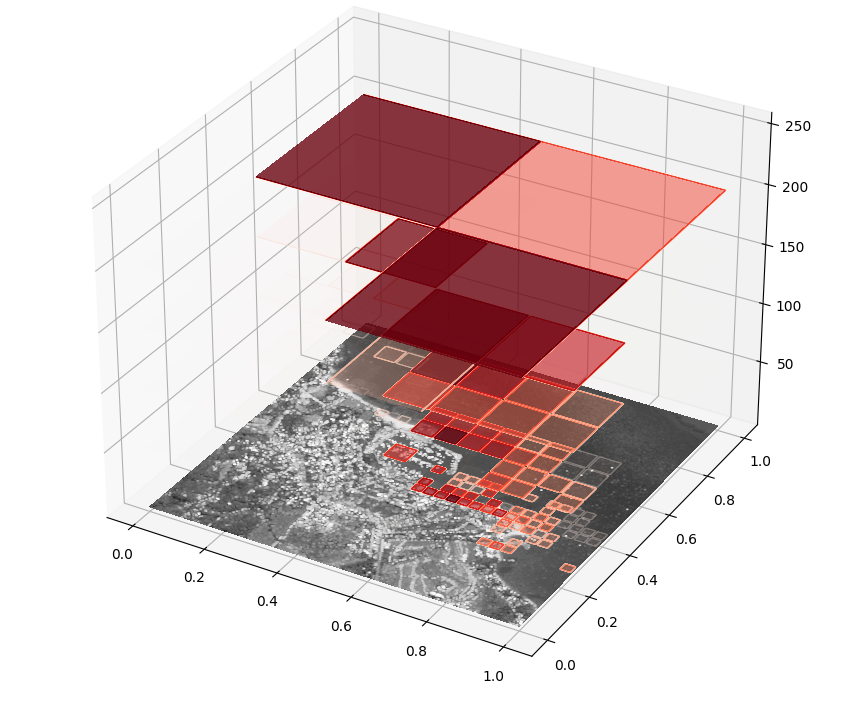
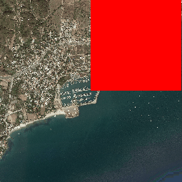
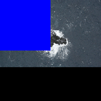

# Reinforced Tree Search

RTS is a Deep Reinforcement Learning agent capable of increase performance of algorithms applied on high resolution images. Instead of using a conventional sliding windows, RTS perform a tree search like by successive zoom in subpart of the image. RTS learn to find the most effective path with the higher probabilities of finding objects.


On the image above RTS we can see that RTS has learn to find object on coastal area. We can also we the successive zooms realized by the algorithm.

RTS can improve time of search in high resolution images.

It has been tested on two problematics:
- finding a object has quickly has possible.
- finding all object in the images has quickly has possible.

RTS perform extremely well on the first and good in the second case.



here is a visualization of the agent trying to find an object, we can see that he has learn to search on coastal area.



In this second example RTS try to find all the sea lion in the image. This image come from the dataset NOAA: https://www.kaggle.com/competitions/noaa-fisheries-steller-sea-lion-population-count/overview

# Demo

in the noaa folder you can find fully implemented demo on the NOAA dataset.

**Caution:** RTS is, in is current state, not ready to be used. It is a proof of concept.
If you want to use it anyway, you can follow the installation and usage instructions.

# Installation instructions

clone this repository:

```
git clone https://github.com/UncleBen420/RTS-Reinforced-Tree-Search-.git
```

install dependencies using pip install:

```
pip install -r requirements.txt
```

Your are now able to use RTS.

# Usage instructions

## Training
